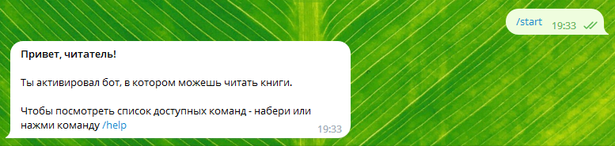

# (ENTERTAINMENT) BOT / readiebot - Telegram-бот (далее - "бот")

## Описание проекта

***Функционал бота:***

Бот позволяет читать книги прямо в чате мессенджера Telegram.
После активации бота с помощью команды /start, бот предложит посмотреть список доступных команд отправив ему команду /help

После отправки команды /help начать чтение книги можно с помощью команды /beginning.

## Деплой бота:
1. Клонируйте репозиторий:
    *$ git clone https://github.com/Aysa-M/readiebot.git*

2. Создайте виртуальное окружение - должен быть флажок (venv) в начале строки:
    *$ python -m venv venv*

3. Установите все необходимые зависимости из файла requirements.txt:
    *$ pip install -r requirements.txt*

4. Создайте аккаунт бота в мессенджере Telegram:

    - *Найдите в Telegram бота @BotFather*: в окно поиска над списком контактов введите его имя.
    Обратите внимание на иконку возле имени бота: белая галочка на голубом фоне. Эту иконку
    устанавливают администраторы Telegram, она означает, что бот настоящий.

    - *Зарегистрируйте бота.*
    Начните диалог с ботом @BotFather: нажмите кнопку Start («Запустить»). Затем отправьте
    команду /newbot и укажите параметры нового бота:
       *имя (на любом языке), под которым ваш бот будет отображаться в списке контактов;
       *техническое имя вашего бота, по которому его можно будет найти в Telegram. Имя должно быть
        уникальным и оканчиваться на слово bot в любом регистре.
       *Если аккаунт создан, @BotFather поздравит вас и отправит в чат токен для работы с Bot API.

    - *Настройте аккаунт бота через @BotFather.*
    Отправьте команду /mybots и вы получите список ботов, которыми вы управляете. Укажите бота,
    которого нужно отредактировать, и нажмите кнопку Edit Bot.
    Можно изменить:
    Имя бота (Edit Name).
    Описание (Edit Description) — текст, который пользователи увидят в самом начале диалога с
    ботом под заголовком «Что может делать этот бот?»
    Общую информацию (Edit About) — текст, который будет виден в профиле бота.
    Картинку-аватар (Edit Botpic).
    Команды (Edit Commands) — подсказки для ввода команд.

5. Для полноценной работы необходимо задеплоить бот на рабочем сервере:
    Необходимо найти хостинг, где вы бы хотели разместить свой проект и развернуть проект
    согласно документации.

**Примечание! Книги нужно будет покупать -> скачивать в формате .txt админу бота самому.**
**Ожидается доработка по выбору конкретной книги для чтения из нескольких имеющихся книг.**

## Технологии (основные инструменты):
- Python==3.11.2
- aiogram==3.0.0b7

## Автор:
**Matsakova Aysa**
